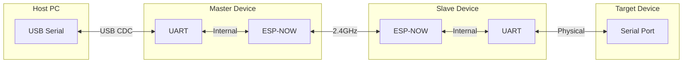
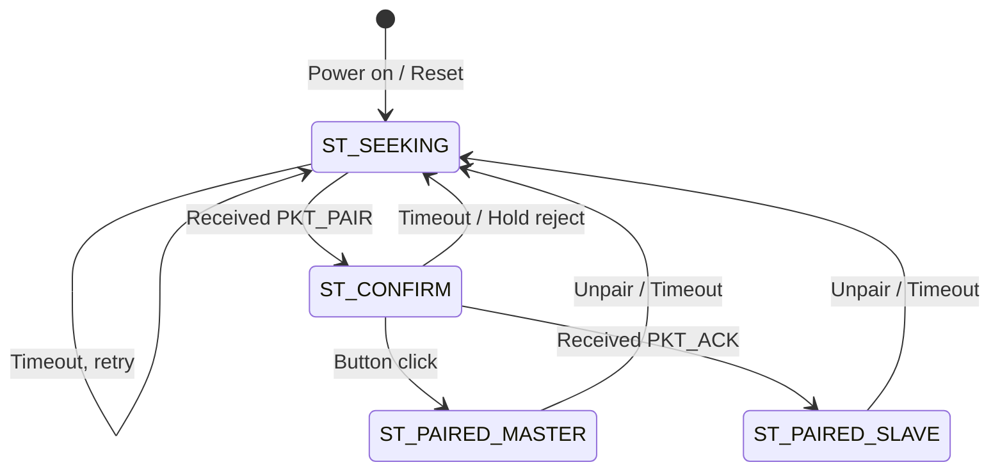

# AirWireCom — Wireless Serial Bridge

[](https://platformio.org/)
[](https://www.espressif.com/)
[](https://www.espressif.com/)

**AirWireCom** is a high-performance wireless serial bridge that creates a transparent UART-over-ESP-NOW connection between two microcontrollers. It eliminates the need for physical serial cables while maintaining low latency and supporting automatic baud rate synchronization.

---

## Table of Contents

- [Overview](#overview)
- [How It Works](#how-it-works)
- [Hardware Requirements](#hardware-requirements)
- [Recommended MCU Configuration](#recommended-mcu-configuration)
- [Pinout](#pinout)
- [Building and Flashing](#building-and-flashing)
- [Pairing Procedure](#pairing-procedure)
- [Protocol Specification](#protocol-specification)
- [State Machine](#state-machine)
- [LED Indicators](#led-indicators)
- [Configuration](#configuration)
- [Technical Details](#technical-details)

---

## Overview

AirWireCom creates a wireless serial tunnel using Espressif's ESP-NOW protocol. It enables:

- **Transparent serial forwarding** — data sent to one device's UART appears on the other
- **Auto-pairing** — devices discover and pair with each other automatically
- **Dynamic baud rate** — master reads host baud rate and synchronizes with slave
- **Persistent connection** — pairing survives reboots (stored in flash)
- **Connection monitoring** — heartbeat packets detect link failures

### Use Cases

- Wireless 3D printer control (replace USB cable between PC and printer)
- Remote serial debugging
- Wireless sensor data collection
- Cable-free UART device communication
- Remote microcontroller programming

---

## How It Works



### Data Flow

1. **Host → Target**: USB CDC → Master's UART → ESP-NOW packet → Slave → Target serial
2. **Target → Host**: Target serial → Slave → ESP-NOW packet → Master → USB CDC → Host

### Role Assignment

Roles are determined during pairing:
- **Slave**: Device that initiates pairing (presses button first, broadcasts `PKT_PAIR`)
- **Master**: Device that accepts pairing (confirms request, manages the connection)

The master reads the host's baud rate (via USB CDC line coding on S2/S3, or RX monitoring on other boards) and forwards it to the slave.

---

## Hardware Requirements

### Supported Platforms

| Platform | Board Examples | Native USB | Auto Baud Detection |
|----------|---------------|------------|---------------------|
| ESP32-S2 | Lolin S2 Mini | ✅ Yes | Not needed |
| ESP32-S3 | Lolin S3, DevKitC-1 | ✅ Yes | Not needed |
| ESP32 | DevKit V1, WROOM | ❌ No | ✅ RX pin monitoring |
| ESP8266 | NodeMCU, Wemos D1 | ❌ No | ✅ RX pin monitoring |

### Bill of Materials

- **2x** ESP32/ESP8266 boards (see recommended configuration below)
- **2x** Buttons (momentary, typically built-in BOOT/FLASH buttons)
- **2x** LEDs (or use built-in LEDs)
- Jumper wires (if external components needed)

---

## Recommended MCU Configuration

### Master Device: **ESP32-S2 Mini**

| Feature | Why ESP32-S2 |
|---------|--------------|
| Native USB | Reads actual baud rate from host via USB CDC line coding |
| Cost | Affordable (~$3-5) |
| Performance | Single-core 240MHz, sufficient for serial bridge |
| Power | Lower power than dual-core ESP32 |

**Why not ESP32-S3?**  
ESP32-S3 works perfectly but is overkill for this application. The S2 is cheaper and consumes less power while providing the same USB functionality.

**Why not ESP32/ESP8266 for Master?**  
These require external CH340/CP2102 USB-UART chips. The firmware cannot read the host's requested baud rate from these chips, requiring fallback to RX monitoring which is less reliable.

### Slave Device: **ESP32 DevKit** or **ESP8266 NodeMCU**

| Feature | Recommendation |
|---------|----------------|
| Cost | ESP8266 is cheapest (~$2-3) |
| Flash | Minimum 4MB recommended |
| GPIO | Enough for LED and button |

**Why ESP8266 is sufficient for Slave:**  
- No USB functionality needed
- ESP-NOW works reliably
- Lower cost
- Serial performance is identical to ESP32 for this use case

### Recommended Pairing

| Setup | Master | Slave |
|-------|--------|-------|
| **Budget** | ESP32-S2 Mini | ESP8266 NodeMCU |
| **Performance** | ESP32-S3 | ESP32 DevKit |
| **Unified** | ESP32-S2 Mini | ESP32-S2 Mini |

---

## Pinout

### ESP32-S2 / ESP32 (Default)

| Pin | Function | Description |
|-----|----------|-------------|
| GPIO 0 | Button | BOOT button (internal pull-up) |
| GPIO 15 | LED | Status indicator (PWM capable) |
| GPIO 4 | RX Monitor | RX edge detection for auto-baud (ESP32 only) |

### ESP8266 (NodeMCU)

| Pin | Function | Description |
|-----|----------|-------------|
| GPIO 0 | Button | FLASH button (internal pull-up) |
| GPIO 2 | LED | Built-in LED (inverted logic) |
| GPIO 14 | RX Monitor | RX edge detection for auto-baud |

### Customization

Edit the pin definitions in [`src/main.cpp`](src/main.cpp:84):

```cpp
#ifdef PLATFORM_ESP8266
constexpr uint8_t PIN_BUTTON = 0;
constexpr uint8_t PIN_LED = 2;
constexpr uint8_t PIN_RX_MON = 14;
#else
constexpr uint8_t PIN_BUTTON = 0;
constexpr uint8_t PIN_LED = 15;
constexpr uint8_t PIN_RX_MON = 4;
// ...
#endif
```

---

## Building and Flashing

### Prerequisites

- [PlatformIO](https://platformio.org/install) installed (VSCode extension or CLI)
- USB cable for your boards

### Build for ESP32-S2 Mini (Master)

```bash
pio run -e s2mini --target upload
```

### Build for ESP32 DevKit

```bash
pio run -e esp32 --target upload
```

### Build for ESP8266 NodeMCU

```bash
pio run -e esp8266 --target upload
```

### Debug Builds

Enable serial debug output:

```bash
pio run -e s2mini_debug --target upload
```

---

## Pairing Procedure

### Initial Pairing

1. **Power on any unpaired devices** – they immediately enter `SEEKING` and broadcast pair beacons (LED breathing); no button press is needed to start seeking.
2. **A device that hears another seeker switches to `CONFIRM`** – its LED changes to double-blink, indicating it can become master if you click the button.
3. **Press the button on the double-blinking device** – it claims the slave and becomes master.
4. **The selected slave receives the claim/ack** – LEDs on both devices turn steady ON when the link is established.
5. **If multiple devices were seeking**, only the first accepted slave is kept; other seekers receive the claim notice and fall back to `SEEKING`.

### Subsequent Boots

Paired devices automatically reconnect using stored MAC addresses. LED goes steady ON within seconds.

### Unpairing

**Hold button for 3 seconds** on either device:
- Sends `PKT_UNPAIR` to peer
- Clears flash storage
- Returns to `SEEKING` mode

### Rejecting a Pair Request

During confirmation (double-blink LED), **hold button for 3 seconds** to reject and return to seeking.

---

## Protocol Specification

AirWireCom uses a custom protocol over ESP-NOW (250-byte max payload).

### Packet Types

| Code | Name | Direction | Payload | Description |
|------|------|-----------|---------|-------------|
| `0x01` | `PKT_DATA` | Bidirectional | `data[]` | Serial data payload (up to 249 bytes) |
| `0x02` | `PKT_PAIR` | Broadcast | — | Pairing request (seeking devices) |
| `0x03` | `PKT_CLAIM` | Broadcast | `MAC[6]` | Master claims slave (prevents double-pair) |
| `0x04` | `PKT_ACK` | Master→Slave | `baud[4]` | Pair confirmation + baud rate |
| `0x05` | `PKT_UNPAIR` | Bidirectional | — | Disconnect request |
| `0x06` | `PKT_BAUD` | Master→Slave | `baud[4]` | Baud rate change notification |
| `0x07` | `PKT_PING` | Master→Slave | — | Heartbeat request |
| `0x08` | `PKT_PONG` | Slave→Master | — | Heartbeat response |

### Packet Format

```
+--------+---------+
| Type   | Payload |
| 1 byte | N bytes |
+--------+---------+
```

### Baud Rate Encoding

Baud rate is packed as little-endian 32-bit integer:

```cpp
buf[0] = baud & 0xFF;
buf[1] = (baud >> 8) & 0xFF;
buf[2] = (baud >> 16) & 0xFF;
buf[3] = (baud >> 24) & 0xFF;
```

### Standard Baud Rates

Auto-detection snaps to nearest standard rate:

- 9600, 19200, 38400, 57600, 115200, 230400, 250000, 500000, 1000000

---

## State Machine



### States

| State | Description | LED Pattern |
|-------|-------------|-------------|
| `ST_SEEKING` | Auto-broadcasting pair beacons from power-on | Breathing fade |
| `ST_CONFIRM` | Heard another seeker; waiting for user click to become master | Double blink |
| `ST_PAIRED_MASTER` | Connected as master | Steady ON (fast blink if offline) |
| `ST_PAIRED_SLAVE` | Connected as slave | Steady ON (fast blink if offline) |

### Transitions

- **SEEKING → CONFIRM**: Received `PKT_PAIR` from another device (detects a seeker)
- **CONFIRM → PAIRED_MASTER**: User clicked button to confirm
- **CONFIRM → PAIRED_SLAVE**: Received `PKT_ACK` with baud rate
- **CONFIRM → SEEKING**: Timeout (15s) or user held button (reject)
- **PAIRED_* → SEEKING**: Unpair command or 35s timeout (no PING/PONG)

---

## LED Indicators

| Pattern | Meaning |
|---------|---------|
| **Breathing fade** | Seeking pair partner |
| **Double blink** | Pair request received, waiting for confirmation |
| **Steady ON** | Paired and online |
| **Fast blink** | Paired but peer offline (>35s no contact) |

### Timing Parameters

```cpp
constexpr uint32_t LED_SEEK_PERIOD = 2000;    // Breathing cycle: 2 seconds
constexpr uint32_t LED_CONFIRM_PERIOD = 1200; // Double blink: 1.2 seconds
constexpr uint32_t LED_OFFLINE_PERIOD = 400;  // Offline blink: 0.4 seconds
```

---

## Configuration

### Debug Output

Uncomment in [`src/main.cpp`](src/main.cpp:67):

```cpp
#define DEBUG
```

Debug output goes to:
- **ESP32-S2/S3**: USB CDC (same port as data)
- **ESP32**: UART0 (Serial)
- **ESP8266**: UART0 (Serial)

### Timeout Values

Edit in [`src/main.cpp`](src/main.cpp:117):

```cpp
constexpr uint32_t SEEK_INTERVAL = 2000;   // Pair broadcast interval
constexpr uint32_t CONFIRM_TTL = 15000;    // Confirmation timeout
constexpr uint32_t PING_INTERVAL = 30000;  // Heartbeat interval
constexpr uint32_t OFFLINE_AFTER = 35000;  // Offline detection
```

### Buffer Sizes

```cpp
constexpr uint8_t DATA_MAX = 249;               // Max ESP-NOW payload
constexpr uint8_t DATA_BUF_SIZE = DATA_MAX + 1; // +1 for type byte
```

---

## Technical Details

### ESP-NOW Configuration

- **Channel**: 0 (current WiFi channel)
- **Encryption**: Disabled (open)
- **Role**: COMBO (can send and receive)
- **Peer Limit**: 6 (ESP32), 20 (ESP8266)

### Storage

| Platform | Method | Namespace |
|----------|--------|-----------|
| ESP32 | Preferences (NVS) | `awc` |
| ESP8266 | EEPROM | — |

Stored data:
- Role (Master/Slave)
- Peer MAC address (6 bytes)
- Baud rate (4 bytes)

### USB CDC (ESP32-S2/S3)

TinyUSB configuration:
- CDC endpoints: 256-byte RX/TX buffers
- MSC enabled (required by Arduino core)
- DFU/HID/MIDI disabled

Baud rate is read via `tud_cdc_n_get_line_coding()` which reflects host's requested rate.

### Auto-Baud Detection (ESP8266/ESP32)

When native USB is unavailable:
1. RX pin monitored via interrupt on edge change
2. Minimum pulse width measured
3. Baud = 1,000,000 / pulse_width
4. Snapped to nearest standard rate

### Performance

| Metric | Value |
|--------|-------|
| Latency | ~2-5ms typical (ESP-NOW + processing) |
| Throughput | ~50-100 KB/s (limited by ESP-NOW) |
| Range | Up to 100-200m line-of-sight |
| Packet size | Up to 249 bytes payload |

---

## Troubleshooting

### Devices won't pair

- Ensure both devices are powered and in range
- Remember seeking starts automatically; press the button only on the device that is double-blinking (candidate master)
- Try unpairing both (hold button 3s) and retry
- Enable DEBUG and check serial output

### Connection drops frequently

- Check power supply stability
- Reduce distance between devices
- Check for WiFi interference (ESP-NOW shares 2.4GHz band)
- Increase `OFFLINE_AFTER` timeout if needed

### Wrong baud rate

- **Master (S2/S3)**: Ensure host actually sets the baud rate in terminal software
- **Master (other)**: Auto-detection may fail with noisy signals; use standard baud rates
- **Slave**: Rate is always set by master; ensure slave supports the baud rate

### Build errors

- Update PlatformIO platforms: `pio platform update`
- Clean build: `pio run --target clean`
- Check TinyUSB configuration for S2/S3 builds

---

## License

MIT License — feel free to use, modify, and distribute.

---

## Contributing

Pull requests welcome! Areas for improvement:
- Encryption support (ESP-NOW PMK/LMK)
- Multiple slave support
- Web configuration interface
- OTA updates

---

**Project**: AirWireCom  
**Protocol**: ESP-NOW ( vendor-specific WiFi )  
**Platforms**: ESP32-S2, ESP32-S3, ESP32, ESP8266  
**Framework**: Arduino (PlatformIO)
